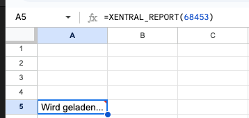
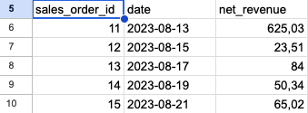

# 🤝 Xentral Google Sheets Connection
Use this script to **query data from your Xentral system directly in Google Sheets**.

You can use two simple functions in your sheet:

- `=XENTRAL_QUERY("SELECT * FROM ...")`  
- `=XENTRAL_REPORT(report-id)`

---

## ✅ Prerequisites

Before you start, you’ll need a **Personal Access Token (PAT)** from your Xentral account.
To generate one:

1. Log in to your Xentral instance.
2. Go to **"Kontoeinstellungen"** (Account Settings).
3. Navigate to the **"Developer Einstellungen"** tab.
4. Click on **"Personal Access Token"**.
5. Generate a new token and **copy it** – you’ll need it in Step 4 below.

---

## 🚀 Setup Instructions (Takes 2 Minutes)

### 1. Open Google Sheets  
Create a new or open an existing Google Sheet where you want to use Xentral data.

### 2. Open the Script Editor  
In your sheet, click:

`Extensions` → `Apps Script`
<br>


---
<br>
This will open a new tab with the Google Apps Script editor.

### 3. Copy the Script Code  
Head over to our GitHub and copy the code from the file: 
🔗 [Code.js](https://github.com/xentral/xentral-gsheet-connection/blob/master/Code.js)  

Remove the existing code:


----
It must be completely empty:


----
Now paste the entire script into the Apps Script editor.
<br>


----
### 4. Add Your Xentral Details
At the **top of the script**, simply adjust these two lines with your Xentral instance and the Personal Access Token (PAT):

```javascript
const XENTRAL_URL = 'https://{your_instance}.xentral.biz' // Your Xentral Instance
const PAT = '' // Your Personal Access Token in between ''
```

For example:
```javascript
const XENTRAL_URL = 'https://abc.xentral.biz';
const PAT = 'abc123yourPATtokenhere';
```

💡 _Don't have a PAT yet? See the "Prerequisites" section above to get one._

### 5. Save the Script  
Click the 💾 **Save** icon (or press `Ctrl + S`).  
You can name the project something like `Xentral Integration`.

### 6. Authorize the Script  

- Hit the ▶️ Run/Ausführen button to execute a test query
- Google will ask for authorization - approve it (you may need to click "Advanced" → "Go to project name").

---

## 🔧 Using the Functions in Your Sheet

Now you're ready to use Xentral data like a pro!

### 🔍 Query with SQL
Use the `XENTRAL_QUERY` function:

```excel
=XENTRAL_QUERY("SELECT sales_order_id, date, net_revenue FROM sales_orders LIMIT 10")
```


> Returns the net revenue per sales_order_id and date

---
### 📑 Use a Saved Report
If you have a report saved in Xentral (with an ID), use:

```excel
=XENTRAL_REPORT(71088)
```

<p align="center">
  
</p>

---
> This pulls the result of a saved report with ID `71088`.
---


---
📌 **Note:** If you open the report in Xentral, you can find the ID in the URL `...&activeReport=71088` <br>
⚠️ **Warning:** The export type needs to be set to `CSV` or `text` and the delimiter to `,` so that GSheet interprets the data correctly.


## 🛟 Troubleshooting

- **Incorrect values in GSheet for XENTRAL_REPORT?**  
  → The export type needs to be set to `CSV` or `text` and the delimiter to `,` so that GSheet interprets the data correctly.

- **"ReferenceError: XENTRAL_URL is not defined"**  
  → Make sure you added `const XENTRAL_URL = ...` at the top of the script.

- **"Authorization Required"**  
  → You need to run and authorize the script once manually.

- **Nothing shows up in the sheet?**  
  → Double-check your SQL/report ID and PAT, and confirm the script has the correct instance URL.

